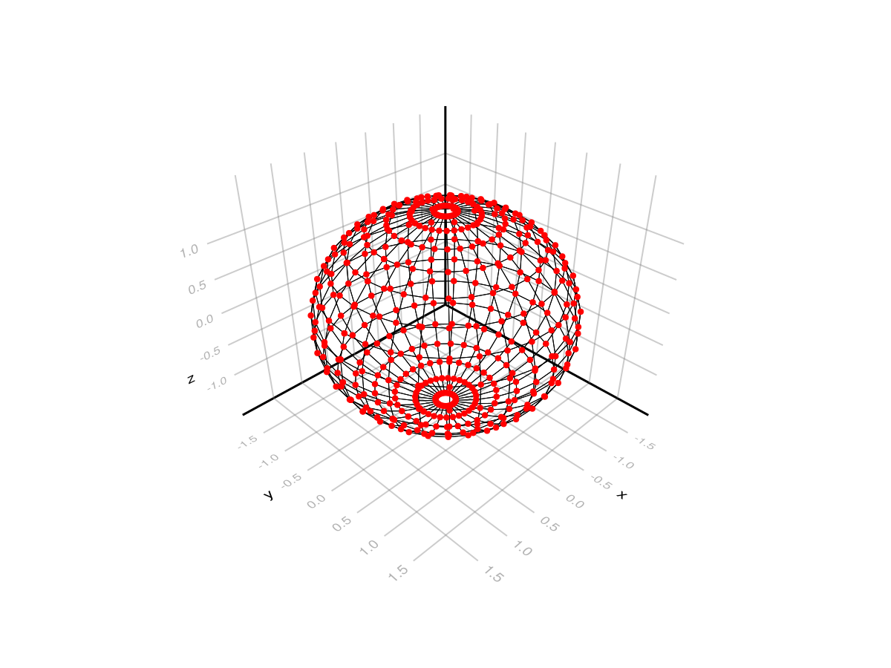

# ApparentHorizonFinder.jl

Find apparent horizons in a spacelike hypersurface.

[](https://github.com/eschnett/ApparentHorizonFinder.jl/actions/workflows/CI.yml)
[](https://eschnett.github.io/ApparentHorizonFinder.jl/dev/)

## Overview

This package implements the fast flow method by Carsten Gundlach:
- Carsten Gundlach, "Pseudo-spectral apparent horizon finders: an
  efficient new algorithm", Phys. Rev. D 57, 863 (1998),
  [DOI:10.1103/PhysRevD.57.863](https://doi.org/10.1103/PhysRevD.57.863),
  [arXiv:gr-qc/9707050](https://arxiv.org/abs/gr-qc/9707050).

## Example

### Define spacetime

Let us look for the horizon in a Kerr-Schild spacetime. We first
define the metric. This function is called from the horizon finder; it
needs to take a 3d point as input and return an `ADMVars` struct.

```julia
using ApparentHorizonFinder
using SpacetimeMetrics
using StaticArrays
function kerr_schild_metric(p::SVector{3})
    x, y, z = p
    M = 1.0
    a = 0.6
    ks = KerrSchild(M, a)
    t = 0
    g, ∂g = dmetric(ks, SVector{4}(t, x, y, z))
    K = ExtrinsicCurvature(ks, SVector{4}(t, x, y, z))
    γ = SMatrix{3,3}(g[i,j] for i in 2:4, j in 2:4)
    ∂γ = SArray{Tuple{3,3,3}}(∂g[i,j,k] for i in 2:4, j in 2:4, k in 2:4)
    admvars = ADMVars(γ, ∂γ, K)
    return admvars
end
```

### Find horizon

Next we call the horizon finder:

```julia
x₀ = SVector{3}(0.0, 0.0, 0.1)
N = 8
r = 2.0
atol = 1.0e-8
maxiters = 100
origin, hlm = find_horizon(kerr_schild_metric, x₀, N, r, atol, maxiters)
pts = horizon_points(origin, hlm)
```

The number of points (and the number of multipoles) depends on the chosen `N`.

### Plot result

```julia
using CairoMakie
using SixelTerm   # optional, to show output directly in the terminal
pts = hcat(pts, pts[:, 1:1]);   # close the φ seam at the back
X, Y, Z = getindex.(pts, 1), getindex.(pts, 2), getindex.(pts, 3);
fig, ax, _ = wireframe(X, Y, Z; color=:black, linewidth=0.5);
scatter!(ax, vec(X), vec(Y), vec(Z); color=:red, markersize = 6);
fig
save("horizon.png", fig)
```


